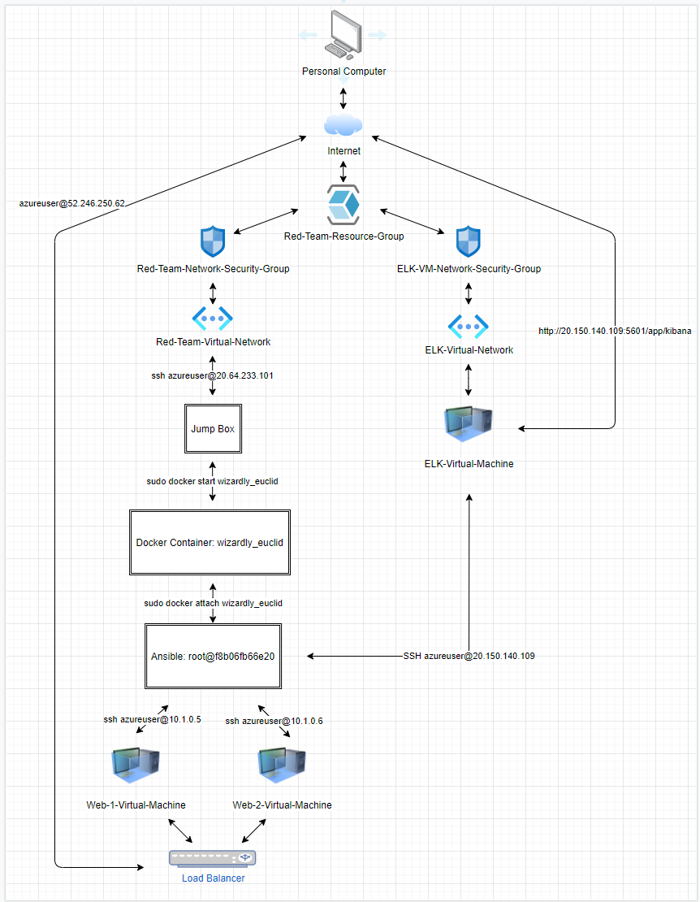
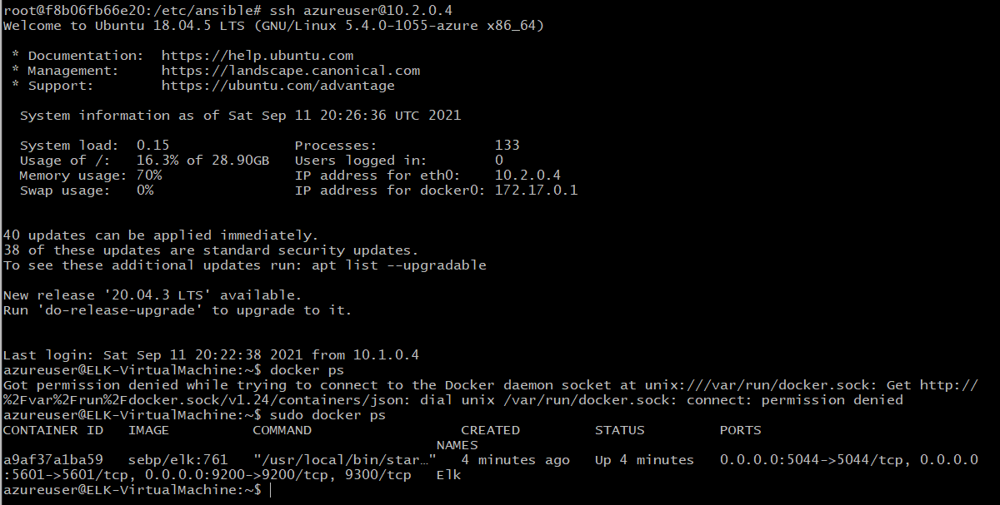

## Automated ELK Stack Deployment

The files in this repository were used to configure the network depicted below.

These files have been tested and used to generate a live ELK deployment on Azure. They can be used to either recreate the entire deployment pictured above. Alternatively, select portions of the ansible file may be used to install only certain pieces of it, such as Filebeat.

This document contains the following details:
- Description of the Topology
- Access Policies
- ELK Configuration
  - Beats in Use
  - Machines Being Monitored
- How to Use the Ansible Build

### Description of the Topology

The main purpose of this network is to expose a load-balanced and monitored instance of DVWA, the Damn Vulnerable Web Application (Web1/Web2).

Load balancing ensures that the application will be highly available, in addition to restricting access to the network.

Protection against emerging threats, DDos attacks and authentic user access are a few aspects of security that load balancers provide. 

When dealing with security, the defense in depth method is paramount. As shown in the diagram above, access to the virtual machines is channeled through the jump box.  This limits the attack vectors available.

Integrating an ELK server allows users to easily monitor the vulnerable VMs for changes to the log data and system operations.

Filebeat watches specified files or locations, and catalogs events for review.

Metricbeat helps monitor servers by providing records of operating system data and services, such as CPU, Memory, and Storage.

The configuration details of each machine may be found below.

| Name      | Function  | IP Address | Operating System |
|-----------|-----------|------------|------------------|
| Jump Box  | Gateway   | 10.1.0.4   | Linux v18.04-LTS |
| Web-1     |HTTP Server| 10.1.0.5   | Linux v18.04-LTS |
| Web-2     |HTTP Server| 10.1.0.6   | Linux v18.04-LTS |
| Elk-Server| Analytics | 10.2.0.4   | Linux v18.04-LTS |

### Access Policies

The machines on the internal network are not exposed to the public Internet. 

Only the Jump Box machine can accept connections from the Internet. Access to this machine is only allowed from the following IP addresses:

73.92.181.56

Machines within the network can only be accessed by the Ansible Container.

Internal access to the ELK VM is only available through the Ansible Container, via the Docker Container, via the Jump Box. The interal IP for the Jump Box is: 10.1.0.4

A summary of the access policies in place can be found in the table below.

| Name     | Publicly Accessible | Allowed IP Addresses External/Internal |
|----------|---------------------|----------------------------------------|
| Jump Box |         No          | 73.92.181.56                           |
| Web-1    |         No          | 73.92.181.56 & 10.1.0.4                |
| Web-2    |         No          | 73.92.181.56 & 10.1.0.4                |
| ELK-VM   |         No          | 73.92.181.56 & 10.1.0.4                |

### Elk Configuration

Ansible was used to automate configuration of the ELK machine. No configuration was performed manually, which is advantageous because it minimizes human error, and is easily deployable accross multiple machines/users.

The playbook implements the following tasks:

-Install Elk
-Install Docker
-Install pip3
-Install Docker python module
-Download and launch a docker web container

The following screenshot displays the result of running `docker ps` after successfully configuring the ELK instance.

### Target Machines & Beats
This ELK server is configured to monitor the following machines:

| Server  | IP Address |
|---------|------------|
| Web-1   | 10.1.0.5   |
| Web-2   | 10.1.0.6   |

We have installed the following Beats on these machines:

- Filebeat
- Metricbeat

These Beats allow us to collect the following information from each machine:

- Filebeats takes logs from specified files and indexes the information for analysis. One example is to collect messages from a container. This enables the a high level of data monitoring that manually would not be feasible on a large scale. 

- Metric beat gathers application and system metrics such as CPU, Memory, Storage. Once a baseline has been established, Metric beat would be useful to detect anomalous activity. 

### Using the Playbook
In order to use the playbook, you will need to have an Ansible control node already configured. Assuming you have such a control node provisioned: 

SSH into the control node and follow the steps below:
- Copy the playbook file to /etc/ansible directory.
- Update the host file to include corresponding user/IP and program language.
- Run the playbook, and navigate to Elk server to check that the installation worked as expected.

- There are two playbooks utilized:  
	/etc/ansible/metricbeat-playbook.yml which is copied into the /etc/ansible/roles/metricbeat-configuration.yml
	/etc/ansible/filebeat-playbook.yml which is copied into the /etc/ansible/roles/filebeat-config.yml

- In order to run the playbook on a specific machine, you must update the /etc/ansible/hosts file to reflect the IP address of the intended server. In order to specify which machine to install the ELK server on versus Filebeat, navigate to the appropriate configuration file and add the intended IP/port.

- In order to check if the ELK server is running, navigate to: http://20.150.140.109:5601/app/kibana
